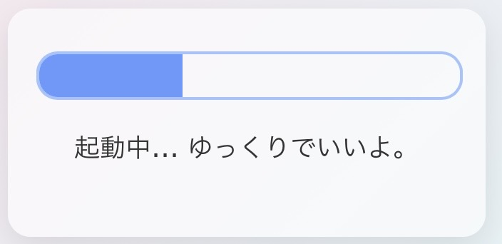

### 🧠 HumanOS 起動中...

起動の遅さを表現しました。   

  
心を表す優しいグラデーションを施しています。

---

コンピュータだって起動が遅いときがある。  
でも人間が起動遅いと、「怠けてる」「早くして」って言われるのは、なんなんだろう。  

そんな疑問と優しさを込めて、**人間の起動を見守るアプリ**を作ってみました。  
「今日ちょっと無理かも」って人も、「まあ、そういう日あるよね」って思ってもらえたら嬉しいです。

---

👉 **[アプリを使ってみる](https://emotional-support-kappa.vercel.app/)**

---

© @Airi  
This code is for personal and educational use only.  
Commercial use is strictly prohibited.
